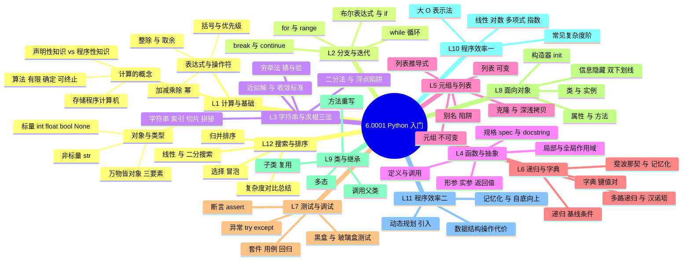

# 6.0001 · 课程思维导图（12 讲知识树）

> 用法：开讲前扫一眼当讲分支（知道要去哪）；学完回来在心里默写一遍分支（检验留没留下东西）。
> Mermaid 版在 GitHub 上直接渲染；下方纯文本版用于离线/打印。

## Mermaid 版



## 纯文本版（打印用）

```
6.0001 Python 入门
├── L1 计算与基础
│   ├── 计算的概念：声明性 vs 程序性知识 · 算法（有限/确定/可终止）· 存储程序计算机
│   ├── 对象与类型：万物皆对象（身份+类型+值）· 标量 int/float/bool/None · 非标量 str
│   └── 表达式与操作符：+ - * / // % ** · 括号与优先级 · 变量绑定与重绑定
├── L2 分支与迭代
│   ├── 布尔表达式 + if/elif/else
│   ├── while（条件循环）· for + range（计数循环）
│   └── break / continue · 字符串比较
├── L3 字符串与求根三法
│   ├── 字符串：索引 / 切片 / 拼接 / 遍历
│   ├── 穷举法（guess & check）→ 近似解（epsilon 收敛）→ 二分法（bisection）
│   └── 浮点数不精确陷阱
├── L4 函数与抽象
│   ├── 定义/调用 · 形参实参 · return（没有 return 的函数返回 None）
│   ├── 作用域：局部 → 全局查找规则
│   └── 规格 spec + docstring：先想清楚接口再写实现
├── L5 元组与列表
│   ├── 元组不可变 · 列表可变
│   ├── 别名陷阱（两个名字指向同一个对象）· 克隆（切片拷贝 vs 深拷贝）
│   └── 列表推导式
├── L6 递归与字典
│   ├── 递归三要素：基线条件 · 递归步骤 · 相信递归
│   ├── 多路递归（汉诺塔/斐波那契）
│   └── 字典：键值对 · 增删查 · 遍历
├── L7 测试与调试
│   ├── 黑盒测试（按规格）+ 玻璃盒测试（按路径）
│   ├── 异常：try/except/else/finally
│   └── 断言 assert：防错于未然
├── L8 面向对象
│   ├── 类与实例 · 属性与方法 · __init__ 构造器
│   └── 信息隐藏（双下划线）· 类变量 vs 实例变量
├── L9 类与继承
│   ├── 子类复用 · 方法重写 · super() 调父类
│   └── 抽象层次与多态
├── L10 程序效率 I
│   ├── 大 O 表示法 · 复杂度阶
│   └── 线性 / 对数 / 多项式 / 指数
├── L11 程序效率 II
│   ├── 常见操作代价（list vs dict 查找）
│   └── 动态规划引入：记忆化斐波那契
└── L12 搜索与排序
    ├── 搜索：线性 O(n) vs 二分 O(log n)（前提：有序）
    └── 排序：选择/冒泡 O(n²) vs 归并 O(n log n)

接口（学完去哪）→ 6.0002 数据科学 · 6.006 算法 · 密码学实现（凯撒/维吉尼亚）
```

## 每讲一句话（记住这个就够了）

| # | 一句话核心 |
|---|---|
| 1 | 程序 = 把「怎么算」写死的算法，跑在存储程序机器上 |
| 2 | 分支管「选路」，迭代管「重复」，两者合起来表达能力就够了 |
| 3 | 穷举 → 近似 → 二分：同一问题，三种收敛效率天差地别 |
| 4 | 函数是抽象的基本单元：spec 想清楚，实现才不返工 |
| 5 | 可变性是一切 bug 之源：先问自己「这是别名还是副本」 |
| 6 | 递归 = 基线条件 + 相信递归；字典 = O(1) 查找 |
| 7 | 没有测试的代码等于没写；异常处理把崩溃变成可控路径 |
| 8 | 对象 = 数据 + 操作数据的方法，绑定在一起 |
| 9 | 继承解决「像但不一样」：重写差异部分，复用其余 |
| 10 | 先算复杂度再优化：指数算法什么都救不了 |
| 11 | 记忆化把指数变成线性——动态规划的第一课 |
| 12 | 二分搜索 + 归并排序 = 分治思想的两次落地 |
